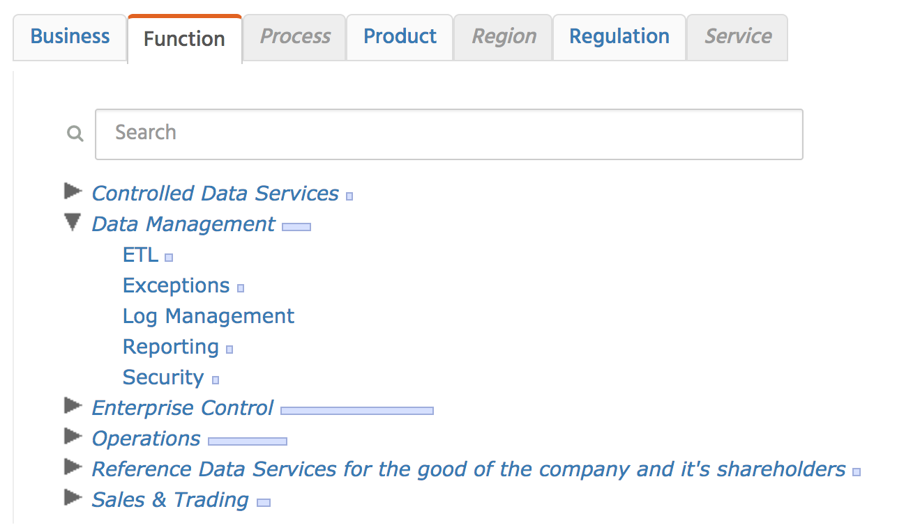
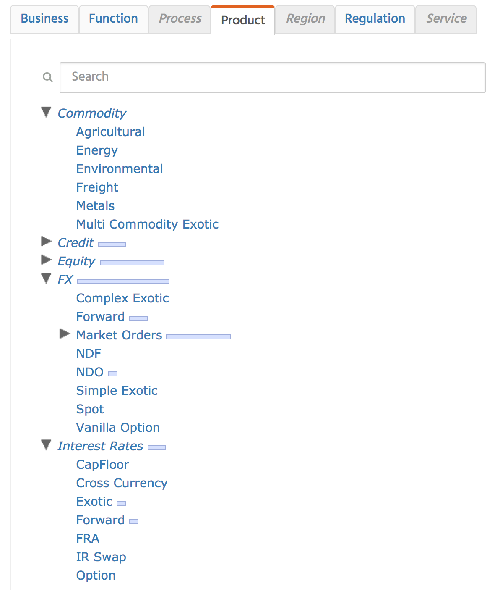
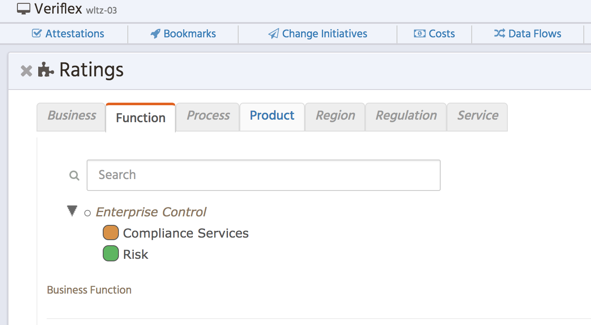
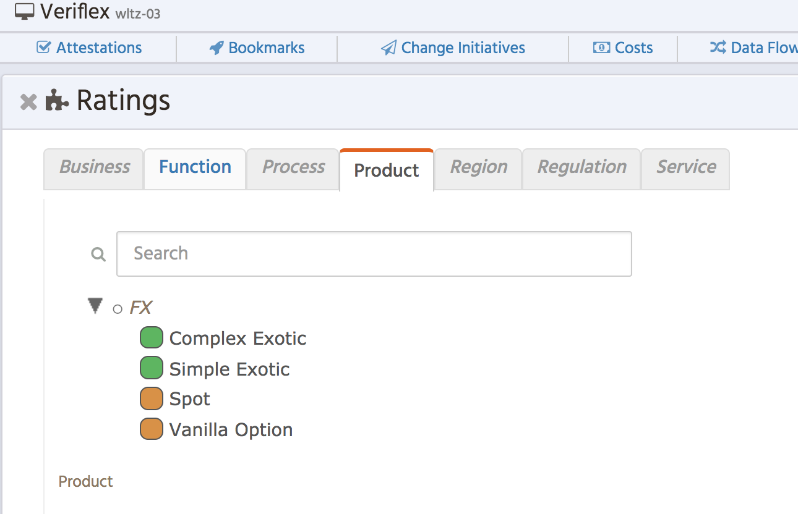
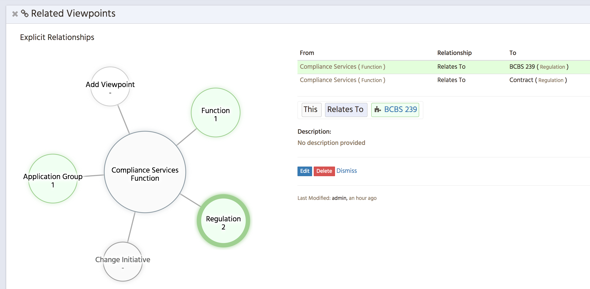
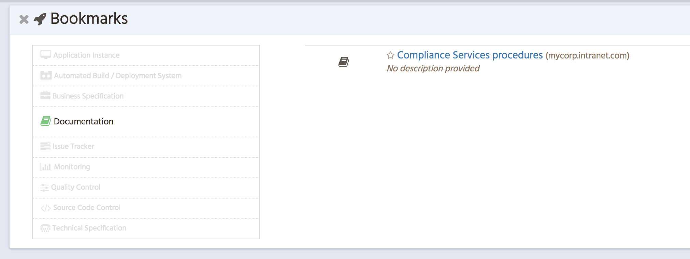
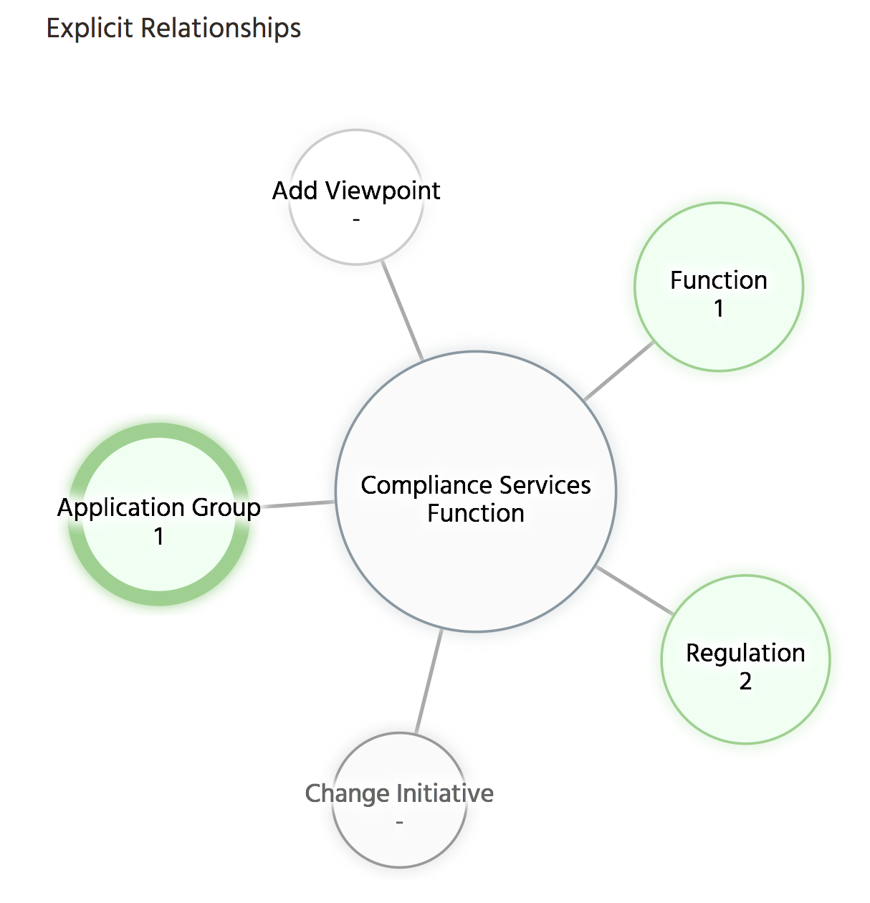
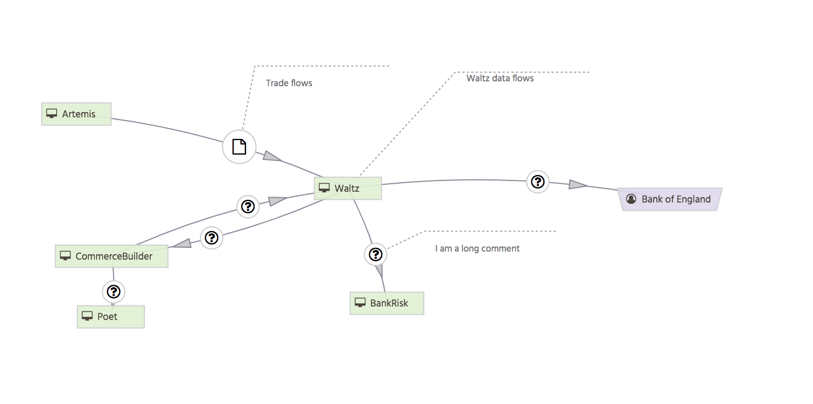

# Using Waltz Viewpoints to manage taxonomies

## Viewpoints

One of the core entities within Waltz is the viewpoint and a large part of Waltz's functionality 
deals with how those viewpoints relate to each other and the technology landscape.  Viewpoints 
are **assigned to categories and organised hierarchically** within a category.  
Example categories are:

| Functions | Products |
| :---: | :---: |
|  |  |

As can be seen above, viewpoint categories vary in size and complexity and can be periodically 
refreshed to capture changing business needs.  The blue bars next to some viewpoints indicate 
that applications have been associated to them.  The size of the bar gives an impression of 
how many (cumulative) applications are associated.  

It is **important to note** that these viewpoint taxonomies are all data defined and can be amended, 
merged and sub-divided as required.

## Linking viewpoints to other elements

Waltz supports numerous relationships involving viewpoints.  The primary relationships are:

- Application Ratings
- Inter-viewpoint relationships

## Application Ratings

Applications can be rated against viewpoints using **custom rating schemes**.  Typical rating schemes 
are _Buy/Sell/Hold_,  _Strategic/Non-Strategic_, _Supports/Does not support_ etc.  Each rating is 
expressed as a simple relationship and may, optionally, include a description and a 
date (for expressing upcoming relationship additions/deletions).

| Application | Rating | Viewpoint |
| :---: | :---: | :---: |
| `Veriflex` | `Strategic` | `Compliance Services` |

Applications can have many of these ratings and they are depicted in the ui as a set of trees grouped 
by the viewpoint category.

For example here are the _functions_ and _products_ for the application `Veriflex`:

| Functions | Products |
| :---: | :---: |
|  |  |

####Rating Limitations

- As these ratings are stored as simple relationships it is **not possible to state more complex expressions**.
    - For example we could **not** say the this application **does not** perform the function `Compliance Services` for 
    product type `Complex Exotic`
  - This leads to Waltz potentially **overstating the scope** of applications.
- Note this can be somewhat mitigated by introducing **perspectives** 
    - see [Using Perspectives and Drill Grid]() at a cost of increased complexity.
 
 
## Inter-viewpoint Relationships

Viewpoints can be linked to other viewpoints to allow a relationships between taxonomy elements to be 
expressed independently from their realization at the application level (via ratings).  Similarly to 
ratings these relationships are expressed as a simple tuple and the relationship type can be 
defined (though is typically left with the default, `Relates To`) 
 
| Viewpoint A | Relationship Kind | Viewpoint B |
| :---: | :---: | :---: |
| `Compliance Services` | `Relates To` | `BCBS239` |

 Viewpoints can be related to any number of additional viewpoints across any categories.  Relationships
 are **directional**  (e.g. A supports B, does not imply B supports A) and may have supporting text. 
 Within the Waltz user interface these relationships are depicted using the 'spindle' diagram, as shown 
 below for `Compliance Services`:
 
 
 
   
 In this diagram we have filtered on related `Regulations` and selected `BCBS239`.  Note that these relationships 
 are **navigable** in the user interface so we may quickly refocus on `BCBS239` if desired.
 
 
 ### Inter-viewpoint Limitations 
 
 - Only simple relationships are possible. 
   - We could not say something like: function TBC relates to TBC only for subject TBC.

## Other Relationships
In addition to ratings and inter-viewpoint relationships Waltz also supports relationships from 
viewpoints to....
 
| Relationship | Description | Example |
| :---: | :---: | :---: |
| People | via roles. e.g. _Compliance_ could have a _Data Owner_ associated with it|  |	
| Bookmarks |	External documentation/resources |  |	
| Application groups | custom groups, visualised via the spindle |  |	
| Flow diagrams | Diagrams showing a particular data flow. Each flow effectively becomes a custom application group.|  |	

It is worth discussing the final two categories (groups and diagrams) in more detail as they may allow 
for more detailed modelling of a problem space.  An application group is simply a collection of applications, 
some groups are manually curated and others are periodically generated (e.g. one customer generates 
_Data Council_ groups). 

Flow diagrams are used to illustrate a path through the enterprise, for example: trade flows from 
capture through to settlement.  The diagrams are stored as a 'Bill of Materials' allowing them to 
be effectively used as a custom application group.  These may be useful in generating regulatory 
responses for specific questions.  E.g. "show me the flows of data around Mortgages dealing with 
Spanish citizens", in this case the data in Waltz held against the viewpoints could be used to 
quickly **narrow the problem space** to a discrete set of applications and a flow diagram could be 
drawn.  Additional information could be gathered by targeting **surveys** against either the resultant 
groups or against relevant viewpoints.
